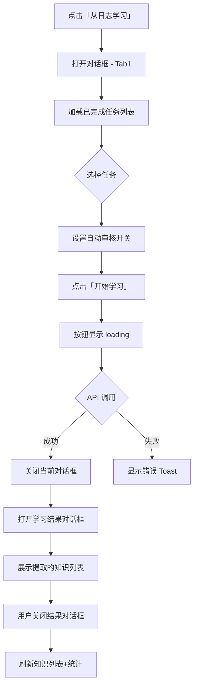
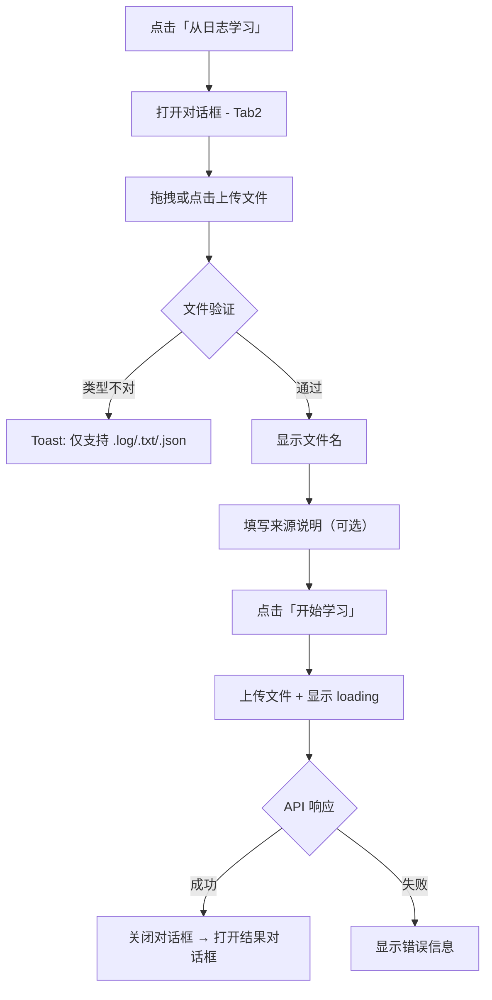
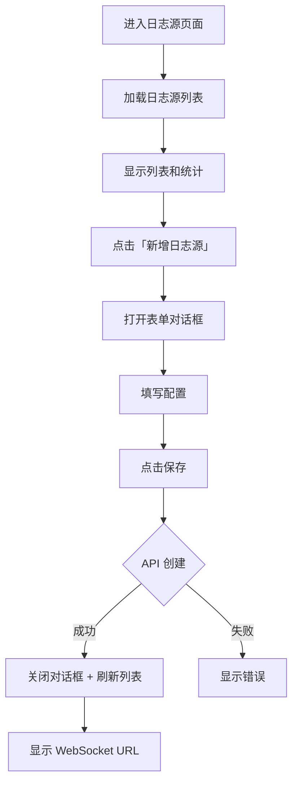

# UI 设计

## 页面列表

| 页面 | 路由 | 说明 |
|------|------|------|
| 知识管理（增强） | `/knowledge/list` | 新增「从日志学习」按钮和对话框 |
| 日志源管理（新增） | `/knowledge/log-sources` | 实时日志源配置和状态监控 |

## 页面布局

### 知识管理页面（增强部分）

现有页面不变，仅在 `header-actions` 区域新增按钮，并增加两个对话框。

```
+------------------------------------------------------------------+
| 知识库管理                [添加知识] [从文本学习] [从日志学习] [重建索引] [刷新] |
+------------------------------------------------------------------+
| 统计卡片行（已有，不变）                                              |
+------------------------------------------------------------------+
| 筛选区域（已有，不变）                                                |
+------------------------------------------------------------------+
| 知识列表表格（已有，不变）                                            |
+------------------------------------------------------------------+

「从日志学习」对话框（700px 宽）:
+------------------------------------------------------------------+
|  从日志学习知识                                            [×]     |
+------------------------------------------------------------------+
|  [从分析任务学习]  [上传日志文件]          ← Tab 切换                |
|  ┌──────────────────────────────────────────────────────────────┐ |
|  │  Tab1: 从分析任务学习                                         │ |
|  │  ┌──────────────────────────────────────────────────────┐   │ |
|  │  │  选择分析任务:  [ 下拉选择 ▼ ]                         │   │ |
|  │  │  (仅显示 completed 状态的任务)                          │   │ |
|  │  │  任务名称 | 请求数 | 创建时间                            │   │ |
|  │  └──────────────────────────────────────────────────────┘   │ |
|  │  ┌──────────────────────────────────────────────────────┐   │ |
|  │  │  自动审核:  [开关]  高置信度知识自动通过审核              │   │ |
|  │  └──────────────────────────────────────────────────────┘   │ |
|  └──────────────────────────────────────────────────────────────┘ |
|  ┌──────────────────────────────────────────────────────────────┐ |
|  │  Tab2: 上传日志文件                                           │ |
|  │  ┌──────────────────────────────────────────────────────┐   │ |
|  │  │          ┌─────────┐                                  │   │ |
|  │  │          │  📄 拖拽  │  点击或拖拽上传日志文件            │   │ |
|  │  │          │  上传区域 │  支持 .log .txt .json             │   │ |
|  │  │          └─────────┘                                  │   │ |
|  │  └──────────────────────────────────────────────────────┘   │ |
|  │  来源说明:  [ 输入框 ]                                        │ |
|  │  最大行数:  [ 数字输入 ]  (可选)                               │ |
|  │  自动审核:  [开关]                                            │ |
|  └──────────────────────────────────────────────────────────────┘ |
|                                          [取消]  [开始学习]       |
+------------------------------------------------------------------+

学习结果对话框（600px 宽）:
+------------------------------------------------------------------+
|  学习结果                                                   [×]   |
+------------------------------------------------------------------+
|  成功从日志中提取了 5 条知识                                       |
|  ┌──────────────────────────────────────────────────────────────┐ |
|  │  标题                    │ 类型     │ 置信度  │ 状态          │ |
|  │  ─────────────────────────────────────────────────────────── │ |
|  │  认证Header格式要求       │ 项目配置  │  0.92  │ ✅ 已通过     │ |
|  │  game-id参数必填          │ 业务规则  │  0.85  │ ✅ 已通过     │ |
|  │  /api/order 高频500      │ 测试经验  │  0.68  │ ⏳ 待审核     │ |
|  │  响应时间阈值 200ms       │ 测试经验  │  0.55  │ ⏳ 待审核     │ |
|  │  Content-Type 固定json   │ 项目配置  │  0.95  │ ✅ 已通过     │ |
|  └──────────────────────────────────────────────────────────────┘ |
|                                                    [关闭]        |
+------------------------------------------------------------------+
```

### 日志源管理页面（新增）

```
+------------------------------------------------------------------+
| 日志源管理                                        [新增日志源] [刷新] |
+------------------------------------------------------------------+
| 统计卡片行                                                        |
| ┌──────────┐  ┌──────────┐  ┌──────────┐  ┌──────────┐          |
| │    2     │  │    1     │  │  15,420  │  │   23     │          |
| │  总日志源  │  │  已连接   │  │  接收行数  │  │ 已提取知识 │          |
| └──────────┘  └──────────┘  └──────────┘  └──────────┘          |
+------------------------------------------------------------------+
| 日志源列表                                                        |
| ┌──────────────────────────────────────────────────────────────┐ |
| │ 名称          │ 状态    │ 接收行数 │ 分析次数 │ 最后活跃  │ 操作  │ |
| │ ──────────────────────────────────────────────────────────── │ |
| │ 生产环境日志    │ 🟢已连接 │ 15,420 │   154  │ 刚刚     │ [编辑] │ |
| │               │        │        │        │         │ [删除] │ |
| │ ──────────────────────────────────────────────────────────── │ |
| │ 测试环境日志    │ 🔴已断开 │  3,200 │    32  │ 2小时前  │ [编辑] │ |
| │               │        │        │        │         │ [删除] │ |
| └──────────────────────────────────────────────────────────────┘ |
+------------------------------------------------------------------+

新增/编辑日志源对话框（600px 宽）:
+------------------------------------------------------------------+
|  新增日志源                                                 [×]   |
+------------------------------------------------------------------+
|  名称:        [ 输入框 ]                                          |
|  描述:        [ 输入框 ]                                          |
|  标签:        [ 多选/可创建 ]                                     |
|  ─────────────────────────────────────────────                   |
|  缓冲设置                                                        |
|  缓冲行数阈值:  [ 100 ]  行                                      |
|  缓冲超时:      [ 30  ]  秒                                      |
|  ─────────────────────────────────────────────                   |
|  自动学习                                                        |
|  自动学习:  [开关 ✅]   分析完成后自动提取知识                      |
|  自动审核阈值:  [ 0.8 ]  (置信度达到此值自动通过)                   |
|  ─────────────────────────────────────────────                   |
|  连接信息                                                        |
|  WebSocket URL:  ws://localhost:8080/ws/logs?source_id=xxx       |
|  (创建后显示，供外部系统连接使用)                                   |
|                                          [取消]  [保存]          |
+------------------------------------------------------------------+
```

## 交互流程

### 从分析任务学习知识



### 上传日志文件学习



### 日志源管理



## Vue 组件树

### 知识管理页面（增强）

```
KnowledgeList.vue（已有，扩展）
├── 统计卡片（已有）
├── 筛选区域（已有）
├── 知识表格（已有）
├── 创建/编辑对话框（已有）
├── 详情对话框（已有）
├── 从文本学习对话框（已有）
├── LogLearnDialog（新增：从日志学习对话框）
│   ├── Tab1: TaskSelector（选择分析任务）
│   └── Tab2: FileUploader（上传日志文件）
└── LearnResultDialog（新增：学习结果展示）
```

### 日志源管理页面（新增）

```
LogSources.vue（新增）
├── 统计卡片行
├── 日志源表格
│   └── 状态指示器（🟢/🔴）
├── 新增/编辑对话框
│   ├── 基本信息表单
│   ├── 缓冲设置表单
│   ├── 自动学习设置表单
│   └── WebSocket URL 展示
└── 删除确认对话框
```

## 组件接口定义

### LogLearnDialog（从日志学习对话框）

| Props | 类型 | 必填 | 说明 |
|-------|------|------|------|
| visible | boolean | 是 | 对话框可见性（v-model） |

| Events | 参数 | 说明 |
|--------|------|------|
| update:visible | boolean | 关闭对话框 |
| learn-success | LearnResult | 学习成功，携带结果数据 |

### LearnResultDialog（学习结果展示）

| Props | 类型 | 必填 | 说明 |
|-------|------|------|------|
| visible | boolean | 是 | 对话框可见性（v-model） |
| result | LearnResult | null | 是 | 学习结果数据 |

| Events | 参数 | 说明 |
|--------|------|------|
| update:visible | boolean | 关闭对话框 |
| close | void | 关闭事件（触发列表刷新） |

## 交互状态

| 元素 | 默认 | 加载中 | 空状态 | 错误 |
|------|------|--------|--------|------|
| 任务选择器 | 下拉列表展示任务 | 加载中... | "暂无已完成的分析任务" | "加载失败，点击重试" |
| 文件上传区 | 拖拽上传提示 | 上传进度条 | - | "上传失败：{原因}" |
| 学习按钮 | 蓝色主按钮 | Spinner + "学习中..." | - | - |
| 结果列表 | 表格展示条目 | - | "未提取到知识" | - |
| 日志源列表 | 表格展示 | 骨架屏 | "暂无日志源，点击新增" | "加载失败" |
| 连接状态 | 🟢已连接 / 🔴已断开 | - | - | - |

## 响应式适配

| 断点 | 宽度 | 布局变化 |
|------|------|----------|
| Desktop | >= 1200px | 侧边栏 + 主内容区，统计卡片 4 列 |
| Tablet | 768-1199px | 折叠侧边栏，统计卡片 2 列 |
| Mobile | < 768px | 隐藏侧边栏，统计卡片 1 列，对话框全宽 |

## 设计规范

遵循项目已有的 TDesign 组件库风格：

- 主色：TDesign 默认蓝（`--td-brand-color`）
- 成功：`--td-success-color`
- 警告：`--td-warning-color`
- 错误：`--td-error-color`
- 字体：TDesign 默认字体规范
- 间距：页面 20px 内边距（与现有 `.knowledge-list { padding: 20px }` 一致）
- 卡片间距：20px（与现有 `.stats-row { margin-bottom: 20px }` 一致）
- 表格：使用 `t-table` + stripe 风格（与现有一致）
- 对话框宽度：600-700px（与现有一致）
